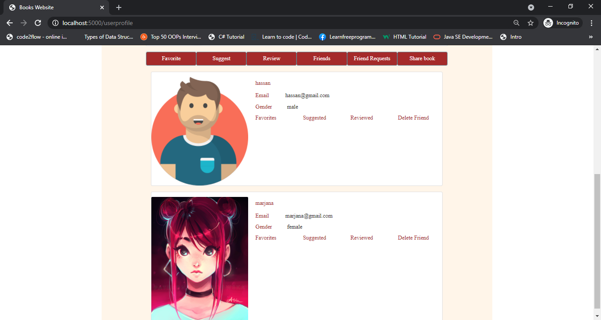

# BookWorld

BookWorld is a book website, which help user to find books and store in thier collection.


## Features

- Homepage:
    user can search books.And add books in favorite, suggested collection. They can also add review of book.
    but for that user has to be log in and signup option.

    

- User Signup:
    User signup page.


- User Signin:
    user sign in page.

 
- User Profile:
    on this page user can see thier profile, friends and collection infromation.

    
- User:
    user can see other user and can send them friend requests.
    - Friend Request
    
    - Friends 
    


  
## Installation 

To run this project first install debpendencies and clone project

```bash
    git clone  https://github.com/Sameea786/project-book.git
```
create and activate virtual enviornment  in windows
```bash
    virtualenv env --always-copy
    source env/bin/activate
```

to install dependencies
```bash 
 pip3 install -r requirements.txt
```

signup for google books API and get API key by  using credential page without 0auth
auth 2.0.

Save your API keys in a file called secrets.sh using this format
```bash
    export GOOGLE_API_KEY="YOUR_KEY_HERE"
```
activate key in your terminal with this command
```bash
    source secrets.sh
```
setup database

```bash
    createdb userbooks
    python3 model.py
    python3 seed.py
```
Run the app

```bash
    python3 server.py

```


## Tech Stack

- Python
- Flask
- jinga2
- PostgresSQL
- SQLAlchemy
- HTML
- CSS
- Bootstrap
- JQuery
- Cloudinary

  